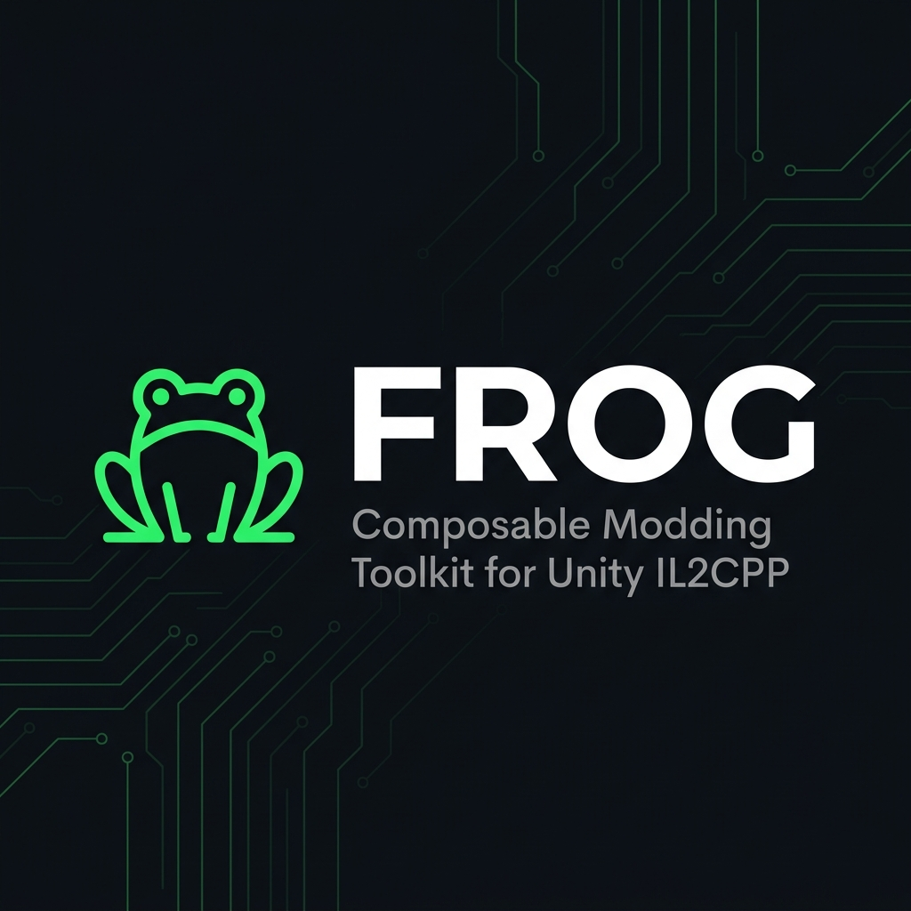
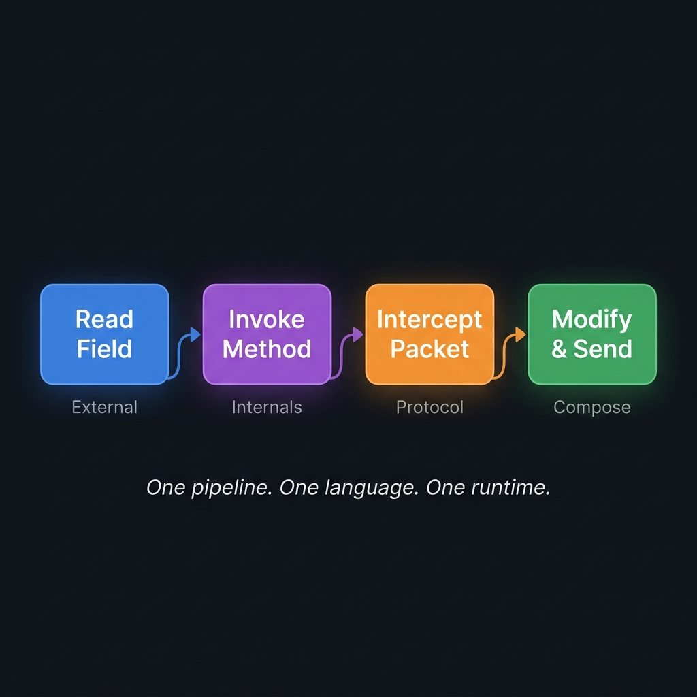
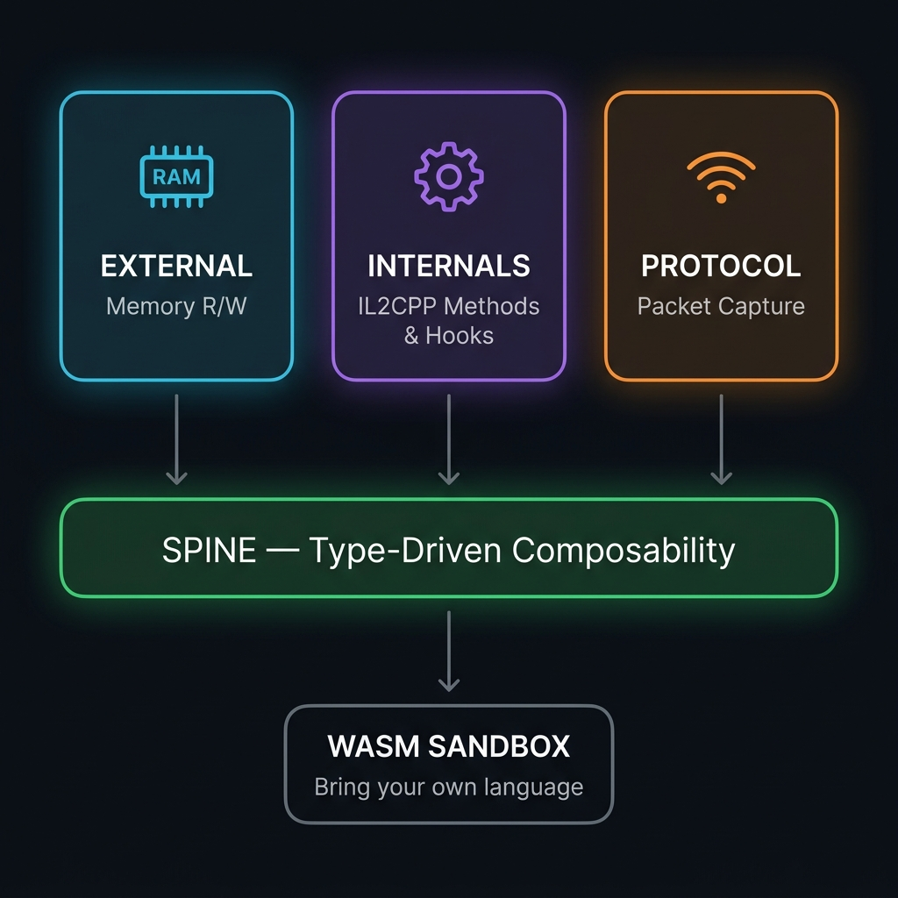

---

**A composable modding toolkit for Unity IL2CPP games.**

Frog doesn't care what Unity version your game is on. It handles encrypted metadata, obfuscated exports, and survives across game updates. You drop it in, it figures things out.

It replaces the workflow of jumping between Frida, Ghidra, Wireshark, Cheat Engine, and whatever else — because Frog does memory, method invocation, and packet capture in one place, and lets you compose all three together through a single type-driven API exposed over WASM.

Bring your own language. Rust, C, Zig, AssemblyScript — if it compiles to WASM, it runs in Frog.

---

## Why Frog Exists

Every Unity modding tool does one thing. A dumper dumps. A memory editor edits memory. A packet sniffer sniffs packets. A hooking framework hooks. You end up with five tools open, gluing them together with scripts in three different languages, copy-pasting addresses between windows.

Frog saw that these three capabilities — **memory**, **method invocation**, and **packet capture** — are each powerful on their own. But they become something else entirely when you can **compose** them.



Read a field from memory → call a game method with that value → intercept the resulting network packet → modify it → let it through. One pipeline. One language. One runtime. No context switching between tools.

---

## Architecture



Three domains, unified by a shared type system called the **spine**. `KlassPtr`, `MethodPtr`, `MemAddr<C>`, `Instance`, `FieldAddr` — these types flow between domains with no manual casting, no serialization, no glue code.

| Crate | Role |
|:--|:--|
| **agent-core** | Pure Rust, no FFI — metadata parser, WASM runtime, spine types, protocol ring. Runs and tests on Linux. |
| **agent** | Windows DLL — memory R/W, IL2CPP FFI, inline detours, packet hooks, WASM orchestration. |
| **version-proxy** | DLL proxy that bootstraps injection via `version.dll`. |

---

## The Three Domains

### 🔧 External — Memory

Read and write game memory with bounds-checked, capability-typed access. Every read is validated against a captured region map — no segfaults from bad pointers.

Write access is enforced **at compile time**: a `ReadOnly` address physically cannot be passed to a write function. The Rust compiler rejects it before the binary is ever built.

```rust
let r: MemAddr<ReadOnly>  = MemAddr::from_raw(addr);
let w: MemAddr<ReadWrite> = unsafe { MemAddr::from_raw_writable(addr) };

r.read::<u32>()?;        // ✅
w.read::<u32>()?;        // ✅
w.write(999u32)?;        // ✅
// r.write(999u32)?;     // ❌ compile error
```

### ⚙️ Internals — IL2CPP

Find classes, resolve fields, invoke managed methods, install inline detours — all through the live IL2CPP runtime. Works on standard builds and obfuscated ones.

When exports are scrambled, Frog falls back to bytecode signature scanning and resolves JMP forwarder chains. When struct layouts shift across Unity versions, a multi-phase calibration probe figures out the correct offsets at startup. If a probe can't determine something with confidence, it falls back to the proven default — never crashes.

### 📡 Protocol — Network

Hooks 10 WinSock and Kernel32 functions — `send`, `recv`, `WSASend`, `WSARecv`, IOCP completion, and more. Captures raw frames into a bounded ring buffer and streams them over a local TCP socket.

The capture path uses `try_lock` so it never blocks the game thread — if there's contention, a frame is dropped rather than stalling gameplay.

---

## Composability

The domains aren't just colocated — they're **integrated at the type level**.

A value produced by one domain is directly consumable by another. This is what makes Frog different from "a dumper + a memory editor + a packet sniffer taped together."

```
let klass    = Internals::find_class("NetworkManager")?;
let method   = Internals::find_method(klass, "SendPacket", 1)?;
let instance = External::read::<u64>(singleton_addr)?;
Internals::invoke(method, instance, &[args])?;
// → Protocol captures the outgoing packet automatically
```

You don't need to be clever. You just need to not be stupid. The API handles the rest.

---

## WASM Runtime

Everything above is exposed to WebAssembly. Drop a `.wasm` file into the game's `scripts/` folder — Frog hot-reloads it automatically.

```wat
(module
  (import "env" "log" (func $log (param i32 i32)))
  (memory (export "memory") 1)
  (data (i32.const 0) "Hello from Frog!")

  (func (export "frog_main")
    i32.const 0
    i32.const 16
    call $log
  )
)
```

The sandbox is real:

- **Fuel-limited** — 1M instructions per call. Infinite loops trap. Game keeps running.
- **Memory-isolated** — bounds-checked guest access. No reading host memory.
- **Capability-gated** — write access is opt-in at instantiation time.

No Lua. No Python. No JS runtime embedded in a game process. WASM is the interface — bring whatever language you want on top.

---

## Version Resilience

Frog supports IL2CPP metadata v16 through v31 — Unity 5.x all the way to Unity 6000.x. When a game updates and shifts struct layouts, Frog's calibration probes re-derive the correct offsets at next startup.

| Metadata | Unity | Status |
|:--|:--|:--|
| v16–v23 | 5.x – 2017.x | ✅ Metadata parsing, v24 offset fallback |
| v24–v26 | 2018.x – 2019.4 | ✅ Fully supported |
| v27–v28 | 2020.x | ✅ Fully supported |
| v29 | 2021.3 | ✅ Fully supported |
| v30–v31 | 2022.x – 6000.x | ⚠️ Supported, deduced offsets |

---

## Anti-Cheat Respect

Frog is a modding tool, not a cheat engine. It detects EAC, BattlEye, Vanguard, Denuvo, and XignCode at load time and **exits cleanly**. No bypass. No circumvention. If your game has anti-cheat, Frog tells you upfront and walks away.

---

## Build & Deploy

```bash
cargo build --target x86_64-pc-windows-gnu --release
./deploy.sh                                  # default game dir
FROG_GAME_DIR=/path/to/game ./deploy.sh      # custom path
```

Copies `version.dll` (proxy) and `agent.dll` into the game folder. Unity loads the proxy on startup, which loads the agent on a background thread.

```bash
cargo test                # 79 tests
cargo test -p agent-core  # core only — runs on Linux
```

---

## Diagnostics

Opt-in runtime probes, set as env vars before launching the game:

| Variable | Probe |
|:--|:--|
| `FROG_MEM_PROBE` | Memory region staleness during live gameplay |
| `FROG_WRITE_PROBE` | Guarded write validation on real addresses |
| `FROG_KLASS_PROBE` | Klass pointer layout verification |
| `FROG_MEMBER_PROBE` | MethodInfo + FieldInfo layout probing |
| `FROG_EXPORT_DUMP` | Resolved export table dump |

---

## License

Private project. Not licensed for redistribution.
